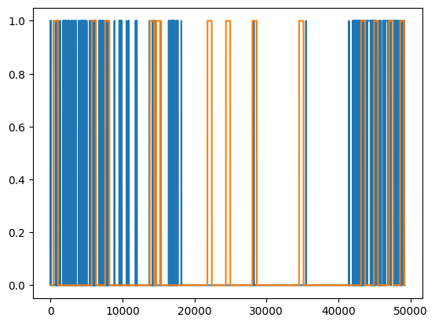
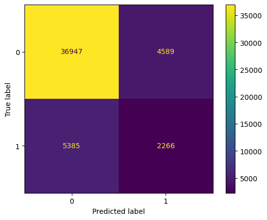
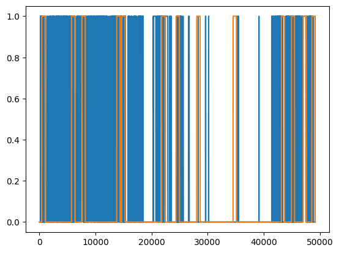
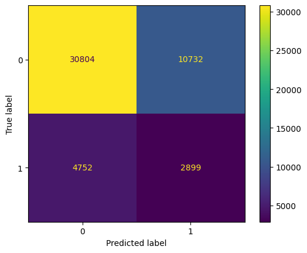

# Tests

---
#### T1

sequence_length = 30
max_layer_neurons = 256
epochs=2, batch_size=64


```
Classification Report:
               precision    recall  f1-score   support

         0.0       0.71      0.62      0.67     73697
         1.0       0.13      0.19      0.16     22715

    accuracy                           0.52     96412
   macro avg       0.42      0.41      0.41     96412
weighted avg       0.58      0.52      0.55     96412
```

---
#### T2

sequence_length = 30
max_layer_neurons = 512
epochs=2, batch_size=64

```
Classification Report:
               precision    recall  f1-score   support

         0.0       0.76      0.55      0.64     73697
         1.0       0.23      0.44      0.30     22715

    accuracy                           0.52     96412
   macro avg       0.50      0.49      0.47     96412
weighted avg       0.64      0.52      0.56     96412
```
---
#### T3 - good one

sequence_length = 30
max_layer_neurons = 1024
epochs=2, batch_size=64

```
Classification Report:
               precision    recall  f1-score   support

         0.0       0.85      0.59      0.70     73697
         1.0       0.34      0.67      0.45     22715

    accuracy                           0.61     96412
   macro avg       0.60      0.63      0.58     96412
weighted avg       0.73      0.61      0.64     96412

```
---
#### T4

sequence_length = 30
max_layer_neurons = 2048
epochs=2, batch_size=64

```
Classification Report:
               precision    recall  f1-score   support

         0.0       0.75      0.78      0.77     73697
         1.0       0.17      0.14      0.15     22715

    accuracy                           0.63     96412
   macro avg       0.46      0.46      0.46     96412
weighted avg       0.61      0.63      0.62     96412

```
---
#### T5 Overfit ?

sequence_length = 30
max_layer_neurons = 1024
epochs=10, batch_size=64

```
Classification Report:
               precision    recall  f1-score   support

         0.0       0.71      0.64      0.67     73697
         1.0       0.13      0.17      0.14     22715

    accuracy                           0.53     96412
   macro avg       0.42      0.40      0.41     96412
weighted avg       0.57      0.53      0.55     96412

```
---
#### T6 - better (with class weights)

sequence_length = 30
max_layer_neurons = 1024
epochs=2, batch_size=64

```
Classification Report:
               precision    recall  f1-score   support

         0.0       0.77      0.89      0.83     73697
         1.0       0.27      0.13      0.18     22715

    accuracy                           0.71     96412
   macro avg       0.52      0.51      0.50     96412
weighted avg       0.65      0.71      0.67     96412
```
---
#### T7 - More accurate 

sequence_length = 90
max_layer_neurons = 1024
epochs=2, batch_size=64

```
Best F1-Score for Class 1: 0.5988
Found at threshold: 0.35

\n==== Classification Report with Optimal Threshold ====\n
              precision    recall  f1-score   support

         0.0       0.93      0.71      0.80     73637
         1.0       0.47      0.84      0.60     22715

    accuracy                           0.74     96352
   macro avg       0.70      0.77      0.70     96352
weighted avg       0.82      0.74      0.76     96352
```
---
#### T8 - Probably overfit

sequence_length = 90
max_layer_neurons = 1024
epochs=4, batch_size=64

```
Best F1-Score for Class 1: 0.4224
Found at threshold: 0.30

\n==== Classification Report with Optimal Threshold ====\n
              precision    recall  f1-score   support

         0.0       0.87      0.36      0.51     73637
         1.0       0.28      0.82      0.42     22715

    accuracy                           0.47     96352
   macro avg       0.58      0.59      0.47     96352
weighted avg       0.73      0.47      0.49     96352
```
---
#### T9 - too complex and overfit

sequence_length = 90
max_layer_neurons = 1024
epochs=2, batch_size=64

```
Best F1-Score for Class 1: 0.3319
Found at threshold: 0.05

\n==== Classification Report with Optimal Threshold ====\n
              precision    recall  f1-score   support

         0.0       0.80      0.13      0.23     34466
         1.0       0.20      0.87      0.33      8844

    accuracy                           0.28     43310
   macro avg       0.50      0.50      0.28     43310
weighted avg       0.68      0.28      0.25     43310
```
---
#### T10
sequence_length = 30
max_layer_neurons = 512
epochs=2, batch_size=64

This test reduced the model's complexity by decreasing the number of neurons to 512 while keeping the sequence length at 30. It utilized class_weight and optimal threshold tuning.

Best F1-Score for Class 1: 0.3145
Found at threshold: 0.05

\n==== Classification Report with Optimal Threshold ====\n
              precision    recall  f1-score   support

         0.0       0.81      0.42      0.56     34526
         1.0       0.21      0.61      0.31      8844

    accuracy                           0.46     43370
   macro avg       0.51      0.51      0.43     43370
weighted avg       0.69      0.46      0.51     43370
---
#### T11 - Could be good...
sequence_length = 90
max_layer_neurons = 1024
epochs=2, batch_size=64
recurrent_dropout=0.5, dropout=[0.4, 0.3, 0.2]

This test used the best performing architecture (T7) and increased dropout rates to combat overfitting [cite: model_book.ipynb].

Best F1-Score for Class 1: 0.3145
Found at threshold: 0.05

\n==== Classification Report with Optimal Threshold ====\n
              precision    recall  f1-score   support

         0.0       0.81      0.42      0.56     34526
         1.0       0.21      0.61      0.31      8844

    accuracy                           0.46     43370
   macro avg       0.51      0.51      0.43     43370
weighted avg       0.69      0.46      0.51     43370

---
#### T12
sequence_length = 90
max_layer_neurons = 128
epochs=2, batch_size=512
Architecture: Bidirectional LSTM

This test introduced a Bidirectional LSTM layer to see if providing both forward and backward context could improve performance. It used a lower neuron count (128) to manage complexity [cite: model_book.ipynb].

Best F1-Score for Class 1: 0.3021
Found at threshold: 0.20

\n==== Classification Report with Optimal Threshold ====\n
              precision    recall  f1-score   support

         0.0       0.91      0.50      0.65     77563
         1.0       0.19      0.69      0.30     13300

    accuracy                           0.53     90863
   macro avg       0.55      0.60      0.47     90863
weighted avg       0.80      0.53      0.60     90863
---
#### T13
sequence_length = 90
max_layer_neurons = 512
epochs=2, batch_size=512
Architecture: Bidirectional LSTM

This test used a more powerful Bidirectional LSTM with 512 neurons to see if it could improve precision over the simpler 128-neuron version [cite: model_book.ipynb].

Best F1-Score for Unfiltered Signal (Class 1): 0.3199
Found at threshold: 0.20

==== Classification Report with F1-Optimized Threshold (Unfiltered) ====

              precision    recall  f1-score   support

         0.0       0.93      0.46      0.62     77563
         1.0       0.20      0.79      0.32     13300

    accuracy                           0.51     90863
   macro avg       0.56      0.62      0.47     90863
weighted avg       0.82      0.51      0.57     90863
---
#### T14
sequence_length = 90
epochs = 2, batch_size = 512
Architecture: Stacked LSTM (256 -> 128 neurons)

This test implemented a deeper, stacked LSTM architecture to see if hierarchical feature learning could improve precision.

Best F1-Score for Unfiltered Signal (Class 1): 0.3062
Found at threshold: 0.80

==== Classification Report with F1-Optimized Threshold (Unfiltered) ====

              precision    recall  f1-score   support

         0.0       0.89      0.64      0.75     77563
         1.0       0.20      0.56      0.31     13300

    accuracy                           0.63     90863
   macro avg       0.55      0.60      0.53     90863
weighted avg       0.79      0.63      0.68     90863
---
#### T15
sequence_length = 30
max_layer_neurons = 512
epochs=20 (with Early Stopping)
batch_size=16
Architecture: LSTM with L2 Regularization and Batch Normalization

This was a comprehensive test combining multiple advanced regularization techniques (L2, Batch Norm, Dropout) and training callbacks on a simpler architecture.

Best F1-Score for Unfiltered Signal (Class 1): 0.2905
Found at threshold: 0.30

==== Classification Report with F1-Optimized Threshold (Unfiltered) ====

              precision    recall  f1-score   support

         0.0       0.88      0.77      0.82     77623
         1.0       0.23      0.41      0.29     13300

    accuracy                           0.71     90923
   macro avg       0.56      0.59      0.56     90923
weighted avg       0.79      0.71      0.74     90923
---
####T16
sequence_length = 30
max_layer_neurons = 512
epochs=20 (with Early Stopping)
batch_size=16
Architecture: LSTM with L2 on both Kernel/Recurrent weights and Batch Normalization.

This test used a shorter sequence length but applied a comprehensive suite of regularization techniques to stabilize the training of a moderately sized LSTM.

Best F1-Score for Unfiltered Signal (Class 1): 0.2977
Found at threshold: 0.40

==== Classification Report with F1-Optimized Threshold (Unfiltered) ====

              precision    recall  f1-score   support

         0.0       0.86      0.82      0.84     77623
         1.0       0.20      0.26      0.23     13300

    accuracy                           0.74     90923
   macro avg       0.53      0.54      0.53     90923
weighted avg       0.76      0.74      0.75     90923
---
#### Final Model Report: Test 17
Configuration
sequence_length: 90
max_layer_neurons: 1024
epochs: 20 (Training was stopped at 7 epochs by the EarlyStopping callback)
batch_size: 400
Architecture:
A single, unidirectional LSTM layer with L2 regularization on both kernel and recurrent weights.
Batch Normalization was applied after the LSTM and Dense layers to improve stability.
Training Method:
EarlyStopping and ReduceLROnPlateau callbacks were used to control overfitting and manage the learning rate.
Performance Results
The model was evaluated by first finding the optimal prediction threshold that maximized the F1-score for the mind-wandering class (1.0).

Best F1-Score for Unfiltered Signal (Class 1): 0.1831
Found at threshold: 0.95

==== Classification Report with F1-Optimized Threshold (Unfiltered) ====

              precision    recall  f1-score   support

         0.0       0.86      0.84      0.85     65629
         1.0       0.17      0.20      0.18     10435

    accuracy                           0.75     76064
   macro avg       0.52      0.52      0.52     76064
weighted avg       0.76      0.75      0.76     76064


# Features Tests

sequence_length = 90
max_layer_neurons = 1024

#### > .2 positive f1 classification features set 
features [1,2,3,4,10,11,12] - EAR, EEAR, FRR, MNAR

Classification Report:
               precision    recall  f1-score   support

         0.0       0.87      0.89      0.88     41536
         1.0       0.33      0.30      0.31      7651

    accuracy                           0.80     49187
   macro avg       0.60      0.59      0.60     49187
weighted avg       0.79      0.80      0.79     49187





#### > .6 accuracy score features set
features [0,7,8,9,10,11,12,13] - IMAR, OMAR, FP, FRR, MNAR, MCAR

Classification Report:
               precision    recall  f1-score   support

         0.0       0.87      0.74      0.80     41536
         1.0       0.21      0.38      0.27      7651

    accuracy                           0.69     49187
   macro avg       0.54      0.56      0.54     49187
weighted avg       0.76      0.69      0.72     49187






